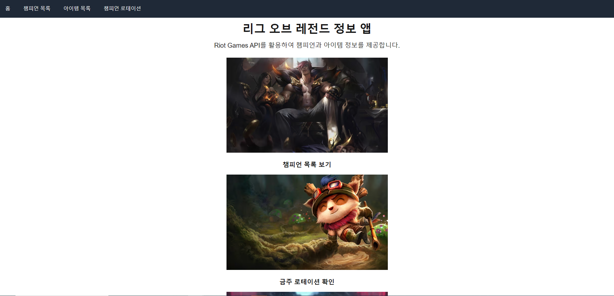
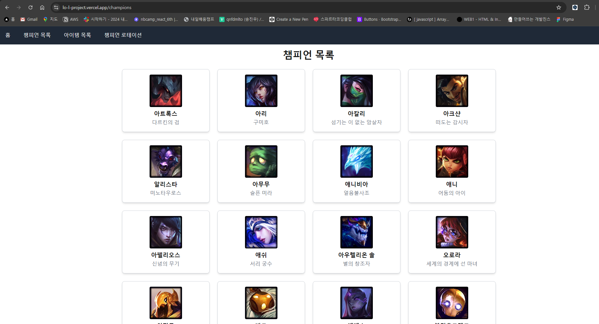
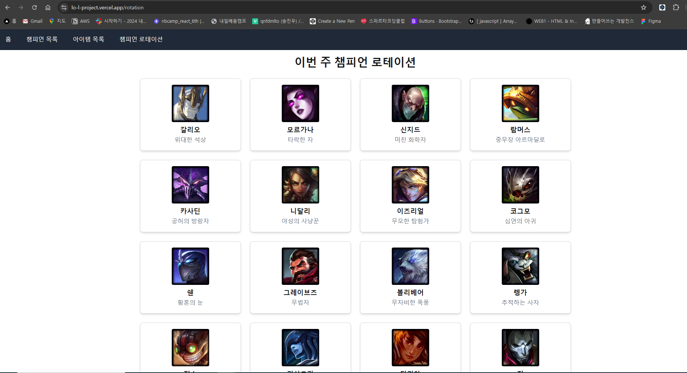
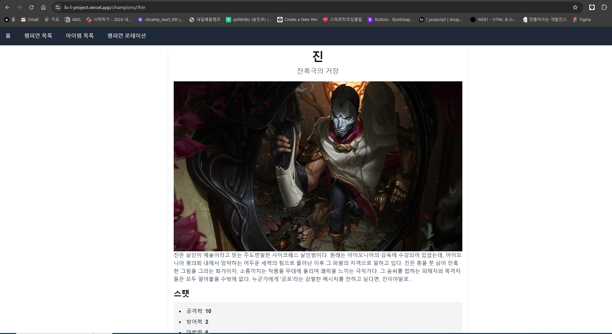
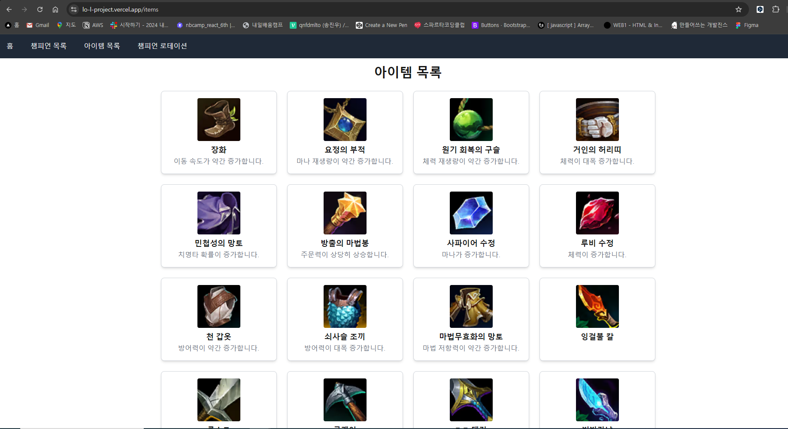
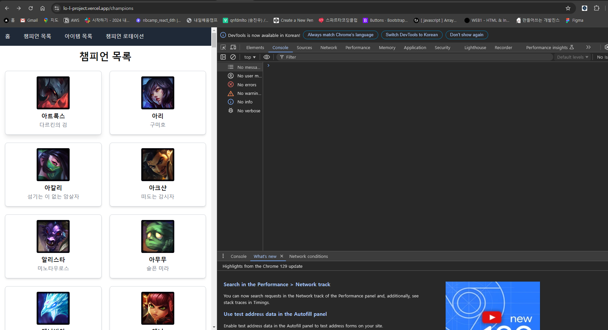

## :pushpin: 롤 백과사전

Riot API를 이용하여 리그오브레전드의 정보를 볼 수 있는 페이지입니다.

## :pushpin: 배포 링크

https://lo-l-project.vercel.app

## :pushpin: 프로젝트 구조

폴더 구조

src 
 ┣ app 
 ┃ ┣ api 
 ┃ ┃ ┗ rotation 
 ┃ ┃ ┃ ┗ route.ts 
 ┃ ┣ champions 
 ┃ ┃ ┣ [id] 
 ┃ ┃ ┃ ┗ page.tsx 
 ┃ ┃ ┣ error.tsx 
 ┃ ┃ ┣ loading.tsx 
 ┃ ┃ ┗ page.tsx 
 ┃ ┣ fonts 
 ┃ ┃ ┣ GeistMonoVF.woff 
 ┃ ┃ ┗ GeistVF.woff 
 ┃ ┣ items 
 ┃ ┃ ┣ error.tsx 
 ┃ ┃ ┣ loading.tsx 
 ┃ ┃ ┗ page.tsx 
 ┃ ┣ rotation 
 ┃ ┃ ┗ page.tsx 
 ┃ ┣ favicon.ico 
 ┃ ┣ global-error.tsx 
 ┃ ┣ globals.css 
 ┃ ┣ layout.tsx 
 ┃ ┣ loading.tsx 
 ┃ ┗ page.tsx 
 ┣ styles 
 ┃ ┗ types 
 ┃ ┃ ┗ utils 
 ┃ ┃ ┃ ┗ public 
 ┣ type 
 ┃ ┣ Champion.ts 
 ┃ ┣ ChampionDetail.ts 
 ┃ ┣ ChampionRotation.ts 
 ┃ ┗ Item.ts 
 ┗ utils 
 ┃ ┣ riotApi.ts 
 ┃ ┗ serverApi.ts 

## :pushpin: 개발환경

## :pushpin: 주요 기능

### 홈페이지

### 챔피언 목록

### 로테이션

### 챔피언 상세

### 아이템 목록

### 반응형

- 각 페이지의 로딩 페이지 구현
- 각 페이지의 에러 페이지 구현

## :pushpin: 트러블 슈팅

### 에러

GET http://localhost:3000/@/app/api/rotation 404 (Not Found) 
console.log를 통해 확인해보면 외부에서 Route handle로 데이터를 잘 가져오고있었다. 그런데 왜 컴포넌트 내에서 데이터를 가져오지 못할까?

### 해결

함수의 이름이 대문자가 아니여서 받아오지 못하는것이였다.
Next.js의 API라우트 시스템에서는 메서드 이름이 대문자로 시작해야하는 규칙이 있다.
소문자로 정의된 메서드는 Next.js가 인식하지 못하고 에러를 발생시킨다. 함수의 이름을 카멜 케이스로 수정하여 오류를 해결했다. 이러한 상황이 여러번 있었던 것 같다...
